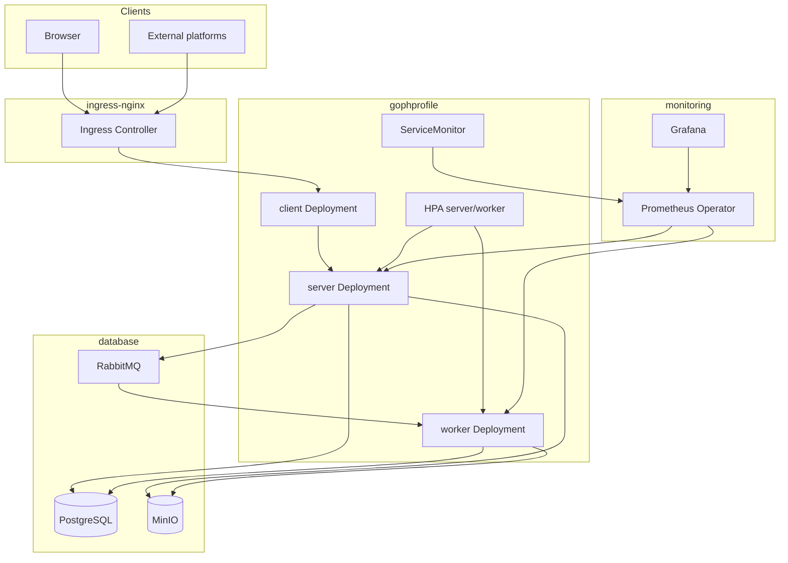
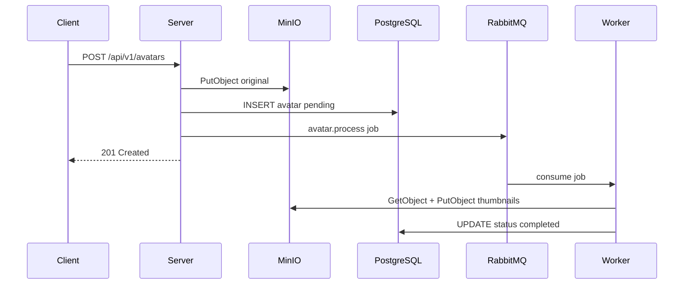

# Архитектура GophProfile

GophProfile — микросервис управления аватарками: HTTP API (server), асинхронный worker (RabbitMQ), PostgreSQL для метаданных, MinIO для объектов.

## Компоненты приложения

| Компонент | Назначение |
|-----------|------------|
| **client** | nginx + статический UI, прокси `/api/` и `/health` → server |
| **server** | REST API, публикация заданий в RabbitMQ |
| **worker** | Генерация миниатюр, удаление объектов в MinIO |

## Kubernetes

## Поток загрузки аватарки

## Безопасность в K8s

- **NetworkPolicy** — ingress только от ingress-nginx и client; egress в namespace `database` и monitoring
- **SecurityContext** — non-root (UID 65532), readOnlyRootFilesystem, drop ALL capabilities
- **Secrets** — `DATABASE_DSN`, `SECRET_KEY`, ключи MinIO/RabbitMQ в Secret, не в ConfigMap
- **RBAC** — ServiceAccount без прав на K8s API
- **Pod Security Standards** — namespace `gophprofile` с label `pod-security.kubernetes.io/enforce: baseline`

## Мониторинг

- Метрики: `/metrics` на порту 9090 (отдельный HTTP-сервер)
- **ServiceMonitor** — автообнаружение подов Prometheus Operator
- Дашборд: `deploy/observability/grafana/dashboards/gophprofile-overview.json`
- Алерты: `deploy/observability/prometheus/alerts.yml`

## Circuit breaker

Внешние вызовы (MinIO, RabbitMQ publish, PostgreSQL ping) обёрнуты в `github.com/sony/gobreaker` (`internal/resilience`).

## Health probes

| Endpoint | Назначение |
|----------|------------|
| `GET /health/live` | Liveness — процесс жив |
| `GET /health/ready` | Readiness — PG, MinIO, RabbitMQ, worker consumer |
| `GET /health` | Обратная совместимость (= ready) |

## Миграции БД

Helm hook `pre-install/pre-upgrade` запускает Job с бинарником `migrate` (`cmd/migrate`).
